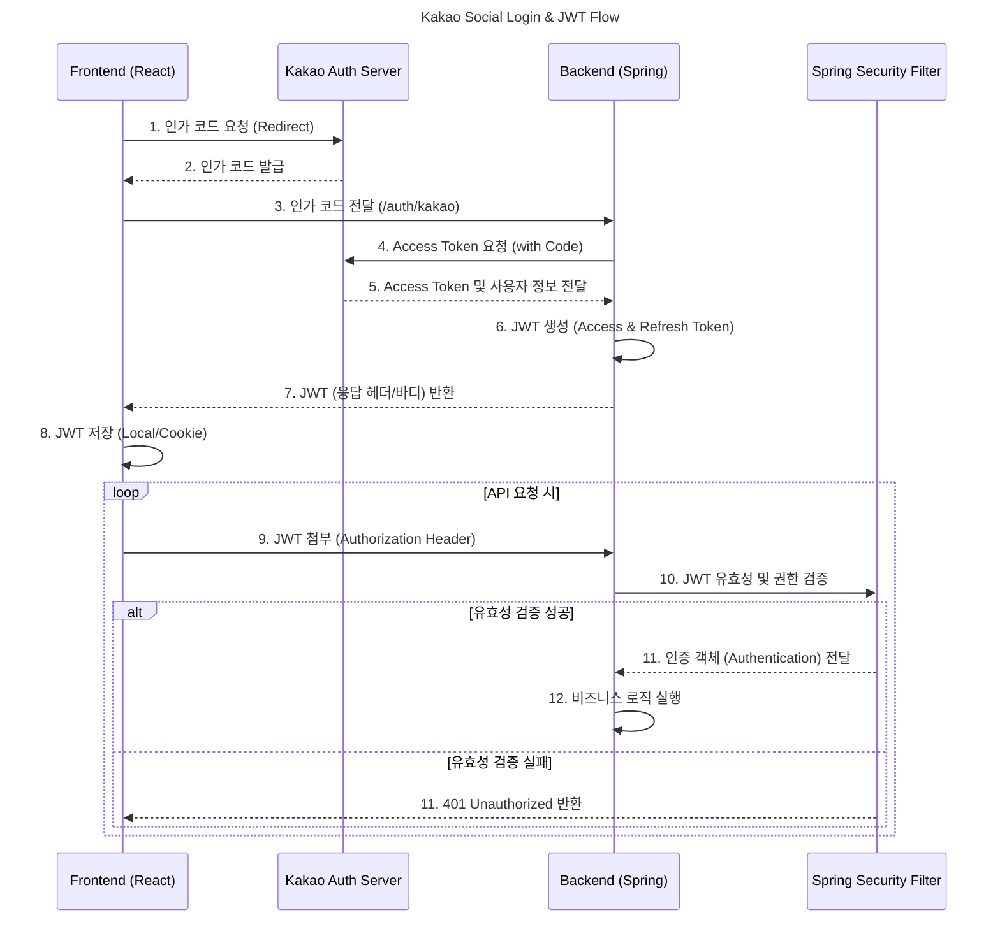

# **🚀 YABAB 프로젝트 핵심 기여 (Core Contribution)**

**역할:** 팀원 / 풀스택 개발자 / 인증 및 권한 관리 전문

**담당:** **JWT 기반 역할 권한 시스템** 설계 및 구현, **카카오 소셜 로그인** 연동, **관리자 및 사장님 전용 페이지** 개발, **핵심 콘텐츠 (구장/음식점, 리뷰 신고)** 페이지 구현

### 🎬 프로젝트 시연 영상 

[<image-card alt="시연 영상 미리보기" src="https://img.youtube.com/vi/yQFHgwuHjG4/0.jpg" ></image-card>](https://www.youtube.com/watch?v=yQFHgwuHjG4)

* **URL:** [전체 영상 보기](https://www.youtube.com/watch?v=yQFHgwuHjG4)

---

## 🔗 프로젝트 전체 히스토리 및 참고 자료

팀 프로젝트의 기획, 회의록, 역할 분담 등 전체적인 맥락을 확인할 수 있는 문서입니다.

* **팀 노션 공개 링크:** [프로젝트 전체 기록 (기획/회의록)](https://temporal-flight-602.notion.site/27877debdf8d80c48541cc32126d0a4e?v=27877debdf8d80c98022000c650699fb&source=copy_link)

## 핵심 기여 모듈 및 소스 코드 (Core Contribution Modules)

이 프로젝트에서 **엄정민 님이 주도적으로 설계 및 구현**한 핵심 기능별 모듈 목록입니다.

| 기능 분류 | 프론트엔드 (Frontend) | 백엔드 (Backend) | DB 테이블/Mapper |
| :---- | :---- | :---- | :---- |
| **인증/인가** | [auth 폴더](https://github.com/zcx1119son/yabab_project/tree/master/frontend/src/components/auth), [MyPage 폴더](https://github.com/zcx1119son/yabab_project/tree/master/frontend/src/components/mypage) | [KakaoAuth](https://github.com/zcx1119son/yabab_project/tree/master/backend/src/main/java/fs/human/yabab/KakaoAuth), [MyPage](https://github.com/zcx1119son/yabab_project/tree/master/backend/src/main/java/fs/human/yabab/MyPage) | `TB_MEMBER`, `TB_AUTHORITY` |
| **역할 기반 관리** | [Admin 폴더](https://github.com/zcx1119son/yabab_project/tree/master/frontend/src/components/admin), [Owner 폴더](https://github.com/zcx1119son/yabab_project/tree/master/frontend/src/components/owner) | [Admin](https://github.com/zcx1119son/yabab_project/tree/master/backend/src/main/java/fs/human/yabab/Admin), [Owner](https://github.com/zcx1119son/yabab_project/tree/master/backend/src/main/java/fs/human/yabab/Owner) | `TB_STORE`, `TB_MEMBER` |
| **핵심 콘텐츠** | [Stadium 폴더](https://github.com/zcx1119son/yabab_project/tree/master/frontend/src/components/stadium), [Pick 폴더](https://github.com/zcx1119son/yabab_project/tree/master/frontend/src/components/pick) | [Stadium](https://github.com/zcx1119son/yabab_project/tree/master/backend/src/main/java/fs/human/yabab/Stadium), [PlayerPick](https://github.com/zcx1119son/yabab_project/tree/master/backend/src/main/java/fs/human/yabab/PlayerRestaurantPick) | `TB_STADIUM`, `TB_RESTAURANT`, `TB_PLAYER_PICK` |
| **예약 시스템** | [Restaurant 폴더](https://github.com/zcx1119son/yabab_project/tree/master/frontend/src/components/restaurant) | [Reserve](https://github.com/zcx1119son/yabab_project/tree/master/backend/src/main/java/fs/human/yabab/Reserve) | `TB_RESERVATION` |
| **리뷰/신고** | [Restaurant 폴더](https://github.com/zcx1119son/yabab_project/tree/master/frontend/src/components/restaurant) | [Review](https://github.com/zcx1119son/yabab_project/tree/master/backend/src/main/java/fs/human/yabab/RestaurantReview), [Report](https://github.com/zcx1119son/yabab_project/tree/master/backend/src/main/java/fs/human/yabab/ReviewReport) | `TB_REVIEW`, `TB_REPORT` |
| **외부 API 연동** | [Owner 폴더](https://github.com/zcx1119son/yabab_project/tree/master/frontend/src/components/owner) | [AddRestaurant](https://github.com/zcx1119son/yabab_project/tree/master/backend/src/main/java/fs/human/yabab/AddRestaurant) | (인증만) |

### 주요 기여 역할 요약

* **백엔드:** **JWT 기반의 Spring Security 인증/인가 파이프라인** 설계 및 **Kakao OAuth** 연동 구현.  
* **프론트엔드:** <strong>역할(Role)</strong>에 따라 접근이 제어되는 **관리자/사장님 페이지**, 사용자 **마이 페이지**, **핵심 콘텐츠(구장/음식점/선수추천)** UI/로직 구현.  
* **기술:** **국세청 API**를 활용한 사장님 실명 및 사업자 검증 로직을 `AddRestaurantPage`에 연동하여 **인증**에만 활용.  
* **데이터베이스:** `TB_MEMBER`, `TB_STORE`, `TB_STADIUM` 등 핵심 데이터 모델링 참여.

## **1. JWT 기반 역할 인증 및 권한 관리 시스템**

Spring Security와 JWT(JSON Web Token)를 사용하여 사용자 인증 및 권한별 접근 제어를 구현하고, 사용자 편의성을 위해 카카오 소셜 로그인을 통합했습니다.

### 인증 방식 및 구현 로직

사용자의 로그인 플로우를 <strong>OAuth 2.0(Kakao)</strong>와 **JWT**로 분리하여 설계 및 구현했습니다.

| 분류 | 상세 구현 내용 |
| :---- | :---- |
| **소셜 로그인** | **Kakao API**를 이용한 인가 코드 발급 및 사용자 정보 획득 |
| **인증 처리** | 획득한 사용자 정보를 기반으로 서버에서 **JWT (Access/Refresh Token)** 발급 |
| **인가 제어** | Spring Security의 FilterChain을 통해 요청 시마다 **JWT를 검증**하고, <strong>사용자 권한(ROLE)</strong>에 따라 **특정 URL 접근을 제어** |
| **역할 분리** | `ROLE_USER`, `ROLE_OWNER`, `ROLE_ADMIN` 3단계 권한 부여 로직 구현 |

### 역할별 주요 페이지 및 기능 구현

| 역할 (Role) | 주요 담당 페이지 | 핵심 기능 |
| :---- | :---- | :---- |
| **ROLE_USER** | 마이 페이지 (My Page) | 개인 프로필 수정, 리뷰 활동 내역 조회 |
| **ROLE_OWNER** | 사장님 페이지 (Owner Page) | 메뉴 및 음식점 정보 등록/수정, 리뷰 관리 |
| **ROLE_ADMIN** | 관리자 페이지 (Admin Page) | 회원 영구 삭제, 신고 리뷰 조회 및 삭제 처리 |

## **2. 핵심 콘텐츠 및 관리 시스템**

야구장별 먹거리 정보의 조회 및 사용자 피드백(리뷰, 신고) 관리 기능을 구현했습니다.

### **2.1. 구장/음식점 정보 조회 및 리뷰 CRUD**

* **구현 페이지:** 구장 및 음식점 상세 정보 페이지 (`/stadium/:id`, `/restaurant/:id`)  
* **핵심 기능:**  
  * **정보 모달:** 음식점 선택 시 상세 정보 (메뉴, 가격) 모달 출력  
  * **리뷰 CRUD:** 사용자 별 리뷰 작성, 수정, 삭제 기능 구현  
  * **구단별 필터링:** `PlayerPickPage`에서 **구단별로** 선수들이 추천하는 맛집 목록을 조회하고 필터링하는 로직 구현

### **2.2. 리뷰 신고 시스템 (Report System)**

| 기능 분류 | 상세 내용 |
| :---- | :---- |
| **신고 접수** | 사용자로부터 신고 사유(스팸, 음란물 등)를 받아 신고 내용 접수 |
| **DB 저장** | `TB_REPORT` 테이블에 신고자 ID, 리뷰 ID, 신고 사유 저장 |
| **관리자 페이지 연동** | 관리자는 신고 내역을 조회하고, 해당 리뷰를 확인 후 삭제할 수 있는 관리 기능 구현 |

## **3. 시스템 아키텍처 및 기술 스택 (Architecture & Tech Stack)**

### **3.1. 인증 흐름 요약 (Text Summary)**

카카오 소셜 로그인 요청부터 JWT 발급 및 인가 제어까지의 핵심 흐름입니다.

## **4\. 🛑 트러블 슈팅 (Troubleshooting & Lessons Learned)**

### **1\. 📋 국세청 API를 활용한 복합 사업자 정보 검증**

| 문제 상황 | 해결 방안 및 기술적 판단 |
| :---- | :---- |
| **상호명 일치 문제:** 사장님 권한 (ROLE\_OWNER) 부여를 위해 국세청 API를 연동했으나, API가 상호명에 대한 **부분 일치**만 허용하여 정확한 식당 상호명과 사업자번호의 일치 여부를 검증하기 어려웠습니다. | **다중 항목 검증 로직 구현:** 사업자번호, 개업일, 대표자명, **상호명**을 모두 전송하는 /validate 엔드포인트를 활용하는 **validateFullBusinessInfo 메서드를 구현**하여 검증 수준을 높였습니다. 최종적으로는 API의 기술적 한계를 보완하기 위해 **사업자등록증 수동 확인 플로우**를 추가했습니다. |
